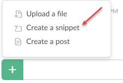
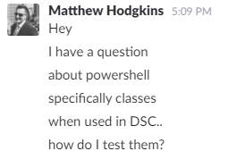

## Using Code Snippets

When pasting large blocks of code, use snippets instead of pasting a wall of text.

## Editing Messages

If you make a mistake when typing a message, simply press the `up arrow` in Slack to fix your mistake.

> :x: Bad Example - Don't fix things on a new line
>

> :white_check_mark: Good Example - Editing previous message
>

## Google first before asking someone?

Asking someone for help should not be your first course of action. Search for solutions yourself first before asking some. If you don't, expect to be [lmgtfy'ed](http://bfy.tw/QI).

## Do you keep your chat on the same line where appropriate?

Slack chat is not the same as having an SMS conversation with 13 year olds - Keep things together where possible and don't split sentences across lines.

> :x: Bad Example - Don't span things across multiple lines
>

> :white_check_mark: Good Example - Saying something in the same line
>
